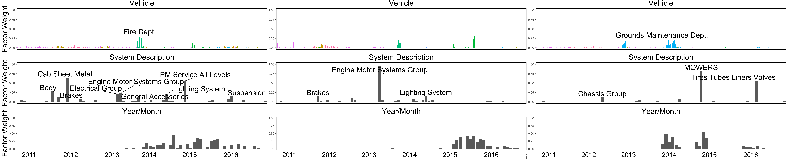

# Detroit Vehicles 

Note: the data used for this analysis is not publicly available and is governed by a data non-disclosure agreement with the City of Detroit Operations and Infrastructure Group. This repository contains the complete source files used to generate the graphics and analysis in the paper:

```
Driving with Data: Modeling and Forecasting Vehicle Fleet Maintenance in Detroit
J. Gardner, D. Koutra, J. Mroueh, V. Pang, A. Farahi, S. Krassenstein, and J. Webb.
https://arxiv.org/abs/1710.06839
```


This README provides guidance on how to replicate the PARAFAC/PRISM analysis presented in our paper, along with the LSTM maintenance prediction model. The ARIMA models are currently provided in a separate repository.

# PARAFAC/PRISM

This section shows the steps to preprocess a dataset, conduct PARAFAC and PRISM (PaRafac-Informed Sequence Mining), and visualize the results using three-way plots.

1. Data preprocessing

    a. Run the preprocessing scripts to generate the 3-way data tensors needed in PARAFAC:

    ``` 
    $ python2 scripts/python2/generate_data_tensor.py -td month_year
    $ python2 scripts/python2/generate_data_tensor.py -td vehicle_year
    ```
    This will deposit CSV files of the data in `tensor-data/`.
    
    b. Generate the sequence data for each vehicle make/model. This will write sequence data in individual text files in `./freq-pattern-data/seqs/`.
    
    ``` 
    $ python2 scripts/python2/generate_vehicle_maintenance_sequences.py
    ```

2. Run PARAFAC *this step requires MATLAB*

    a. In MATLAB, first run the `install_tensor_toolbox.m` script to load the PARAFAC libraries (included in this repo).
    
    b. Edit the file `tensor_decomp.m` to point to the relevant input files, and to have the correct output files. 
    
    c. Run `tensor_decomp.m` in MATLAB. As this script runs, you should see output of the following form:
    
    ``` 
    Nonnegative PARAFAC:
     Iter  1: fit = 1.495350e-01 fitdelta = 1.5e-01
     Iter  2: fit = 2.156228e-01 fitdelta = 6.6e-02
     Iter  3: fit = 2.765258e-01 fitdelta = 6.1e-02
     Iter  4: fit = 3.227131e-01 fitdelta = 4.6e-02
     Iter  5: fit = 3.548078e-01 fitdelta = 3.2e-02
     ... 
   ```

3. Using the factor loading matrices, compute the in-group and out-groups via PRISM. Note that the PRISM scripts are written in *Python 3* due to the Bayesian modeling libraries being only available in Python 3.

    ``` 
    $ python3 scripts/python3/run_prism.py
    ```


4. Generate the 3-way plots in R using `scripts/R/tensor_plots.Rmd`. 

    a. Edit the file `scripts/R/tensor_plots.Rmd` to point to the correct factor loading matrices (by default these should be correct) and set the `analysis_type` variable to either `vehicle_year_log` or `month_year_log` as desired.
    
    b. Run `scripts/R/tensor_plots.Rmd`. This script can be run in an IDE (e.g. RStudio), or from the command line via
    
    ```
    $ Rscript scripts/R/tensor_plots.Rmd
    ```
    This will produce a series of plots in `img` similar to those shown below.
    
    

# Maintenance Prediction LSTM:

This section describes the steps to train and evaluate the LSTM described in the paper for maintenance prediction. Note that the LSTM model is modified from the original code in the Tensorflow 1.x repository [here](https://github.com/tensorflow/docs/blob/master/site/en/r1/tutorials/sequences/recurrent.md). Note that TensorFlow 1.x is in *maintenance mode only* as of 2020.

1. Create the files with maintenance sequences by make/model; each line represents a unique vehicle:
```$ python3 generate_vehicle_maintenance_sequences.py```

2. Clean up those sequences into a format the Tensorflow code likes:
```$ python3 lstm_preproc.py ```

3. Train the model (note that this script is in PYTHON 2; the other scripts are in PYTHON 3!):
```$ python2 ptb/ptb_word_lm.py  --data_path=/path/to/output/dir/from/lstm_preproc/ ```

    ```
    2017-06-22 14:16:23.243476: W tensorflow/core/platform/cpu_feature_guard.cc:45] The TensorFlow library wasn't compiled to use SSE4.2 instructions, but these are available on your machine and could speed up CPU computations.
    2017-06-22 14:16:23.243503: W tensorflow/core/platform/cpu_feature_guard.cc:45] The TensorFlow library wasn't compiled to use AVX instructions, but these are available on your machine and could speed up CPU computations.
    2017-06-22 14:16:23.243508: W tensorflow/core/platform/cpu_feature_guard.cc:45] The TensorFlow library wasn't compiled to use AVX2 instructions, but these are available on your machine and could speed up CPU computations.
    2017-06-22 14:16:23.243513: W tensorflow/core/platform/cpu_feature_guard.cc:45] The TensorFlow library wasn't compiled to use FMA instructions, but these are available on your machine and could speed up CPU computations.
    WARNING:tensorflow:Standard services need a 'logdir' passed to the SessionManager
    Epoch: 1 Learning rate: 1.000
    Epoch: 1 Train Perplexity: 593.959
    Epoch: 1 Valid Perplexity: 114.834
    Epoch: 2 Learning rate: 1.000
    Epoch: 2 Train Perplexity: 77.896
    Epoch: 2 Valid Perplexity: 41.869
    Epoch: 3 Learning rate: 1.000
    Epoch: 3 Train Perplexity: 48.058
    Epoch: 3 Valid Perplexity: 47.353
    Epoch: 4 Learning rate: 1.000
    Epoch: 4 Train Perplexity: 38.648
    Epoch: 4 Valid Perplexity: 29.654
    Epoch: 5 Learning rate: 0.500
    Epoch: 5 Train Perplexity: 23.264
    Epoch: 5 Valid Perplexity: 22.252
    Epoch: 6 Learning rate: 0.250
    Epoch: 6 Train Perplexity: 17.788
    Epoch: 6 Valid Perplexity: 15.532
    Epoch: 7 Learning rate: 0.125
    Epoch: 7 Train Perplexity: 16.802
    Epoch: 7 Valid Perplexity: 15.344
    Epoch: 8 Learning rate: 0.062
    Epoch: 8 Train Perplexity: 16.635
    Epoch: 8 Valid Perplexity: 15.284
    ...
    ```
